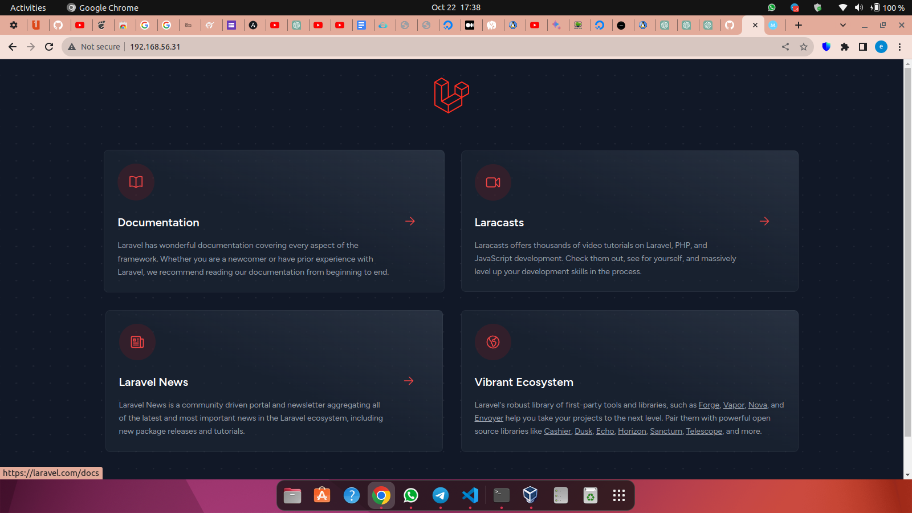
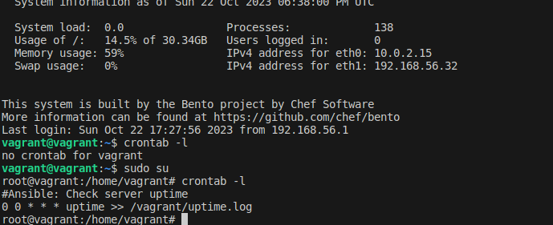

---

# Project Documentation: Deploying a LAMP Stack

## Table of Contents

1. [Project Overview](#project-overview)
2. [Project Objectives](#project-objectives)
3. [Project Requirements](#project-requirements)
4. [Vagrant Configuration](#vagrant-configuration)
5. [Bash Script for LAMP Stack Deployment](#bash-script-for-lamp-stack-deployment)
6. [Ansible Playbook](#ansible-playbook)
7. [Inventory File](#inventory-file)
8. [Ansible Configuration](#ansible-configuration)
9. [Testing and Verification](#testing-and-verification)
10. [Project Submission](#project-submission)
11. [Screenshots](#screenshots)

## [Project Overview](project-overview)

This documentation provides a detailed guide for automating the deployment of a LAMP (Linux, Apache, MySQL, PHP) stack using Vagrant, Bash scripting, and Ansible. The project involves setting up two Ubuntu-based servers, "Master" and "Slave," to deploy a PHP Laravel application from a GitHub repository.

## [Project Objectives](project-objectives)

The objectives of this project are as follows:

- Automate the provisioning of two Ubuntu-based servers using Vagrant.
- Deploy a LAMP stack on the "Master" server using a Bash script.
- Clone a PHP Laravel application from the GitHub repository.
- Configure Apache web server, MySQL, and other necessary packages.
- Ensure the Bash script is reusable and well-documented.
- Use an Ansible playbook to execute the Bash script on the "Slave" server.
- Create a cron job to check the server's uptime every day at 12 am.

## [Project Requirements](project-requirements)

To successfully complete this project, the following requirements must be met:

1. **GitHub Repository**: Create a publicly accessible GitHub repository and submit the Bash script and Ansible playbook.

2. **Documentation**: Create comprehensive documentation in markdown format, detailing each step of the project. Include screenshots as evidence where necessary.

3. **URL**: Utilize either the VM's IP address or a domain name as the URL for the deployed application.

### GitHub Repository:
[GitHub Repository Link](https://github.com/Amiekhame/AutoLAMPS.git)

## [Vagrant Configuration](vagrant-configuration)

The Vagrant configuration is defined in the "Vagrantfile." This file provisions the "Master" and "Slave" VMs. Below is the configuration:

```ruby
# Vagrant.configure("2") do |config|
# Define the "Master" server
config.vm.define "master" do |master|
  master.vm.box = "bento/ubuntu-20.04"
  master.vm.network "private_network", ip: "192.168.56.31"
  master.vm.provision "shell", path: "emma.sh"
  master.vm.provider "virtualbox" do |vb|
    vb.memory = 1024
    vb.cpus = 1
  end
end

# Define the "Slave" server
config.vm.define "slave" do |slave|
  slave.vm.box = "bento/ubuntu-20.04"
  slave.vm.network "private_network", ip: "192.168.56.32"
  slave.vm.provider "virtualbox" do |vb|
    vb.memory = 1024
    vb.cpus = 1
  end
end
# end
```

**Vagrantfile Documentation:**
- The "Vagrantfile" is written in Ruby and defines the Vagrant configuration.
- The configuration specifies two virtual machines: "Master" and "Slave."
- The "Master" VM uses the Ubuntu 20.04 box and is assigned the IP address 192.168.56.31.
- The "Slave" VM uses the same Ubuntu 20.04 box and is assigned the IP address 192.168.56.32.
- The provisioner is set to execute the "emma.sh" Bash script on the "Master" VM.
- Virtualbox is selected as the provider, with 1024 MB of memory and 1 CPU for each VM.

## [Bash Script for LAMP Stack Deployment](bash-script-for-lamp-stack-deployment)

The "emma.sh" Bash script automates the deployment of the LAMP stack on the "Master" server. It performs the following tasks:

```bash
#!/bin/bash

# Check if the script is being run as root.
if [[ "${UID}" -ne 0 ]]
then
  sudo -E "${0}" "${@}"
  exit
fi


# Define variables
GIT_REPO="https://github.com/laravel/laravel.git"
DB_ROOT_PASSWORD=$(openssl rand -base64 32)

# Update and Upgrade server
apt-get update && apt-get upgrade -y

# Add important package repositories
apt-get install -y software-properties-common
add-apt-repository -y ppa:ondrej/php

# Install AP stack and important extensions
apt-get install -y apache2
apt-get install -y php8.2 php8.2-mysql php8.2-curl php8.2-gd php8.2-intl php8.2-mbstring php8.2-soap php8.2-xml php8.2-xmlrpc php8.2-zip php8.2-bcmath php8.2-common php8.2-cli php8.2-tokenizer libapache2-mod-php8.2 curl git unzip zip

# Start and enable apache
systemctl start apache2
systemctl enable apache2

# configure php.ini
sed -i "s/;cgi.fix_pathinfo=1/cgi.fix_pathinfo=0/" /etc/php/8.2/apache2/php.ini

# Install Composer
export COMPOSER_ALLOW_SUPERUSER=

1
curl -sS https://getcomposer.org/installer | php -- --install-dir=/usr/local/bin --filename=composer

# Configure Apache
cat <<EOF > /etc/apache2/sites-available/laravel.conf
<VirtualHost *:80>
    ServerName 192.168.56.31
    ServerAdmin webmaster@localhost
    DocumentRoot /var/www/html/laravel/public

    <Directory /var/www/html/laravel>
        AllowOverride All
    </Directory>

    ErrorLog ${APACHE_LOG_DIR}/error.log
    CustomLog ${APACHE_LOG_DIR}/access.log combined
</VirtualHost>
EOF

# Enable the laravel.conf site
a2enmod rewrite
a2ensite laravel.conf
a2enmod php8.2

# Set root user and password for MySQL
debconf-set-selections <<< "mysql-server mysql-server/root_password password ${DB_ROOT_PASSWORD}"
debconf-set-selections <<< "mysql-server mysql-server/root_password_again password ${DB_ROOT_PASSWORD}"
apt-get install -y mysql-server

# Navigate into the web directory
cd /var/www/html || exit

# Clone the git repository
git clone $GIT_REPO

# Navigate to the laravel directory
cd /var/www/html/laravel || exit

# Install dependencies
composer install --no-dev --optimize-autoloader --no-interaction

# Set permissions
chown -R www-data:www-data /var/www/html
chmod -R 755 /var/www/html/laravel
chmod -R 755 /var/www/html/laravel/storage
chmod -R 755 /var/www/html/laravel/bootstrap/cache

# Copy the .env.example file to .env
cp .env.example .env

# Generate the application key
php artisan key:generate

# Database setup
mysql -u root -p"${DB_ROOT_PASSWORD}" <<EOF
CREATE DATABASE laravel;
GRANT ALL PRIVILEGES ON laravel.* TO 'root'@'localhost' WITH GRANT OPTION;
FLUSH PRIVILEGES;
EOF

# update the .env file with database credentials
sed -i "s/DB_PASSWORD=.*/DB_PASSWORD=$DB_ROOT_PASSWORD/g" .env

# Cache the config
php artisan config:cache

# Migrate the database
php artisan migrate --force

# restart apache
systemctl restart apache2
```

**Key Steps in the Bash Script:**
- Checks if the script is being run as root.
- Defines variables and sets the GitHub repository and database root password.
- Updates and upgrades the server, adds important package repositories, and installs the Apache web server and essential PHP extensions.
- Configures Apache, installs Composer, and configures PHP.
- Sets up the MySQL database and Laravel application.
- Creates necessary directories, sets permissions, and generates keys.

## [Ansible Playbook](ansible-playbook)

The "emma.yml" Ansible playbook is responsible for executing the Bash script on the "Slave" server and creating a cron job. It includes the following tasks:

```yaml
---
- name: Execute deployment script and create a cron job
  hosts: all
  become: yes

  tasks:
    - name: Copy deployment script
      copy:
        src: ./emma.sh
        dest: /tmp/emma.sh
        mode: 0755

    - name: Edit the bash script before execution
      replace:
        path: /tmp/emma.sh
        regexp: '192.168.56.31'
        replace: '192.168.56.32'
        backup: yes

    - name: Execute deployment script
      shell: /tmp/emma.sh

    - name: Create a cron job to check the server's uptime every day at 12 am
      cron:
        name: "Check server uptime"
        minute: "0"
        hour: "0"
        job: "uptime >> /vagrant/uptime.log"
```

**Ansible Playbook Documentation:**
- The Ansible playbook defines a set of tasks to be executed on all hosts (in this case, both "Master" and "Slave" servers).
- It copies the deployment script, edits it to match the "Slave" server's IP, executes the script, and creates a cron job to check the server's uptime daily at 12 am.

## [Inventory File](inventory-file)

The "inventory" file contains a list of the servers targeted by Ansible. In this case, it includes the "Master" and "Slave" servers:

```
vagrant@192.168.56.31
vagrant@192.168.56.32
```

## [Ansible Configuration](ansible-configuration)

The "ansible.cfg" file configures Ansible's behavior. It specifies the inventory file, private key file, and disables host key checking. Below is the content of the "ansible.cfg" file:

```ini
[defaults]
inventory = inventory
private_key_file = ~/.ssh/ansible
host_key_checking = False
```

## [Testing and Verification](testing-and-verification)

To ensure the project's success, follow these testing steps:

1. **Provision VMs**: Use Vagrant to provision the "Master" and "Slave" VMs.

2. **Execute Bash Script**: Verify that the Bash script is successfully executed on the "Slave" node. Ensure that the PHP Laravel application is accessible through the VM's IP address.

3. **Cron Job**: Confirm the creation of the cron job that checks the server's uptime every day at 12 am.

## [Project Submission](project-submission)

To submit the project, follow these steps:

1. **Push to GitHub**: I pushed all my project code, including the "Vagrantfile," "emma.sh," "emma.yml," "inventory," and "ansible.cfg," and screenshots for evidence to my GitHub repository.

2. **GitHub Repository Link**:I shared the link to my GitHub repository using the provided submission form.

## [Screenshots](important-screenshots-to-serve-as-evidence)






This comprehensive documentation covers every aspect of the project, including the code for the Vagrantfile, Ansible playbook, and Bash script.